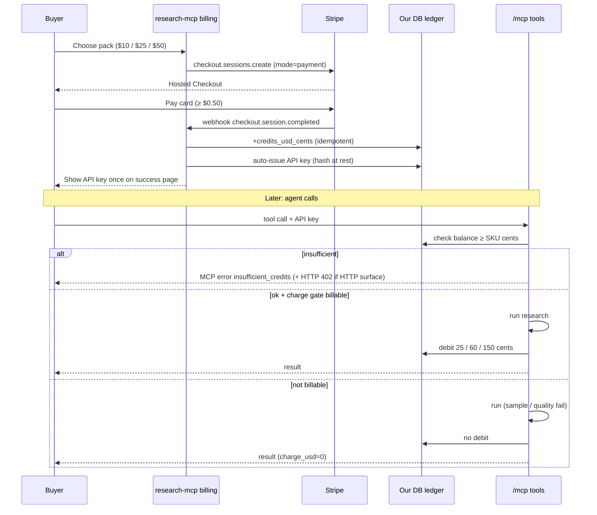

# Stripe setup brief — research-mcp prepaid credits

**Audience:** Michael (approve Dashboard actions) + Dodger / Billing agent (implement).  
**Date:** 2026-09-14  
**Scope:** Human-held Stripe + prepaid credit packs. No marketplace meter. No account creation / live charges in this brief.  
**Repo facts:** charge gate + SKU stubs in `src/usage.ts`; auth = env `API_KEYS` (`src/auth.ts`); usage logger is stdout JSON stub today.

SKU map (billable only):

| SKU | USD | Maps to |
| --- | --- | --- |
| lite | $0.25 | `research_brief` depth=`quick`; `source_lookup` |
| standard | $0.60 | `research_brief` depth=`standard`; `compare_options` |
| deep | $1.50 | `research_brief` depth=`deep` |

Card floor: **$0.50 USD** minimum charge — cannot bill lite/standard as one-off card PaymentIntents.  
Sources: [Stripe currencies — min charge](https://docs.stripe.com/currencies#minimum-and-maximum-charge-amounts), [pricing-addendum.md](../pricing-addendum.md).

---

## Standing decisions (Dodger 2026-09-14)

1. **Test mode only** until Fly is up **and** Michael says go-live.
2. **Packs** $10 / $25 / $50 MVP; **bonus credits = none** for v0.
3. **Billing Credits deferred** (path C stays; revisit later only).
4. **Key issuance:** auto on `checkout.session.completed` webhook.
5. **Webhook / success URLs:** wait for Fly app URL.
6. **Ledger DB:** SQLite for alpha; Postgres when real volume / host volume.
7. **Insufficient funds:** MCP tool error (clear message) + HTTP **402** on HTTP surface if present.
8. **Refund → manual ledger reverse in alpha;** steps documented below (never auto).
9. **Keep env `API_KEYS` as break-glass** alongside customer keys — yes.

---

## 1. Recommendation

### Compare (prepaid, sub-dollar debit)

| Path | Fits sub-$0.50 call debit? | Real-time balance gate? | MVP weight | Notes |
| --- | --- | --- | --- | --- |
| **A. Billing Credits** (Credit Grants + Meters + metered Price + Subscription) | Indirect only (credits apply when **invoice finalizes**, not per MCP call) | No — invoice-cycle | Heavy | Requires meter + subscription; credits scoped to metered prices only. Docs: [Billing credits](https://docs.stripe.com/billing/subscriptions/usage-based/billing-credits), [implementation guide](https://docs.stripe.com/billing/subscriptions/usage-based/billing-credits/implementation-guide), [Credit Grants API](https://docs.stripe.com/api/billing/credit-grant) |
| **B. Customer Balance** (invoice credit / cash) | No for call wallet | No | Misleading | Invoice credit auto-applies to **next invoice**; cash balance is bank-transfer reconciliation, **not** a top-up wallet. Docs: [Customer credit balance](https://docs.stripe.com/invoicing/customer/balance), [Customer balance / cash](https://docs.stripe.com/payments/customer-balance) |
| **C. Checkout one-time Products/Prices (credit packs) + our ledger** | Yes — packs ≥ $0.50; we debit cents in DB | Yes — check/decrement before/after tool | Light | Charge via Checkout `mode=payment`; webhook credits our DB; usage stub becomes ledger writer. Docs: [Checkout](https://docs.stripe.com/payments/checkout), [Create Checkout Session](https://docs.stripe.com/api/checkout/sessions/create), [Fulfill orders](https://docs.stripe.com/checkout/fulfillment) |

### MVP winner: **C — Checkout credit packs + our DB ledger**

**Why:** Only path that (1) respects the $0.50 card floor, (2) supports $0.25 / $0.60 / $1.50 call debits in real time against the existing charge gate, (3) avoids Billing Meters/Subscriptions for v0, (4) plugs into the current stdout usage stub with a DB behind it. Stripe is the **top-up rail**; we own the **meter**.

Revisit Billing Credits later only if we want Stripe-native invoice settlement for a metered subscription SKU (monthly buckets). Do **not** use Customer Balance as the MCP wallet.

---

## 2. Exact Stripe objects to create

All in **Test mode** first. Amounts in cents. Packs locked: **$10 / $25 / $50**, no bonus credits for v0.

### Products (one-time catalog)

| Dashboard / API name | `metadata` | Purpose |
| --- | --- | --- |
| `Research MCP — Credits $10` | `pack=starter`, `credits_usd_cents=1000`, `product=research_mcp` | Starter pack |
| `Research MCP — Credits $25` | `pack=standard`, `credits_usd_cents=2500`, `product=research_mcp` | Default pack |
| `Research MCP — Credits $50` | `pack=pro`, `credits_usd_cents=5000`, `product=research_mcp` | Larger pack |

Optional later (not MVP): Product `Research MCP — Monthly 50 standard` for bucket SKU from pricing-addendum.

### Prices (one-time, USD)

| Nickname | `unit_amount` | `currency` | `product` | `metadata` |
| --- | --- | --- | --- | --- |
| `credits_10` | `1000` | `usd` | Credits $10 | `credits_usd_cents=1000`, `pack=starter` |
| `credits_25` | `2500` | `usd` | Credits $25 | `credits_usd_cents=2500`, `pack=standard` |
| `credits_50` | `5000` | `usd` | Credits $50 | `credits_usd_cents=5000`, `pack=pro` |

Create via Dashboard **Product catalog → Add product → One-time**, or Prices API. Store resulting `price_…` IDs in env (below). **Michael** creates these in Dashboard (out of scope for Code tickets).

### Customers

- Create on first Checkout (Checkout can create: `customer_creation=always` or pass existing `customer`).
- Our DB: `customers(id, stripe_customer_id, email, created_at)`.
- Link API keys → customer: `api_keys(key_hash, key_prefix, customer_id, status)`.

### Checkout Session (top-up)

```text
mode: payment
line_items: [{ price: PRICE_ID, quantity: 1 }]
success_url: https://<app>/billing/success?session_id={CHECKOUT_SESSION_ID}
cancel_url:  https://<app>/billing/cancel
client_reference_id: <our_customer_uuid>   # or metadata
metadata:
  our_customer_id: <uuid>
  pack: starter|standard|pro
  credits_usd_cents: "1000"|"2500"|"5000"
customer_creation: always   # if new buyer
```

Do **not** use PaymentIntent alone for MVP UI — hosted Checkout is fewer moving parts ([Checkout Sessions](https://docs.stripe.com/payments/checkout-sessions)). PaymentIntent is fine behind Checkout; we fulfill from the Session webhook.

**URLs:** placeholders until Fly app URL is known (standing decision #5).

### Credit Grant / balance objects

- **MVP: none in Stripe.** Balance lives in our ledger (`balance_cents`, append-only `ledger_entries`).
- Do **not** create Billing Credit Grants for MVP (those apply to metered subscription invoices only — [eligibility](https://docs.stripe.com/billing/subscriptions/usage-based/billing-credits#credit-grant-eligibility)). Billing Credits deferred (standing decision #3).

### Our ledger (required; not a Stripe object)

**Alpha:** SQLite. **Later:** Postgres when real volume / Fly host volume (standing decision #6).

Suggested tables (names illustrative):

- `credit_accounts(customer_id PK, balance_cents INT NOT NULL, updated_at)`
- `ledger_entries(id, customer_id, delta_cents, reason, stripe_event_id UNIQUE NULL, checkout_session_id NULL, usage_request_id NULL, sku NULL, created_at)`
- `customers(id, stripe_customer_id, email, created_at)`
- `api_keys(key_hash, key_prefix, customer_id, status, created_at)`
- Idempotency: unique on `stripe_event_id` (and/or `checkout_session_id` for grants).

Debit amounts (cents): lite `25`, standard `60`, deep `150`.

---

## 3. Env vars + webhook events

### Env vars (Code & PRs must wire)

| Name | Required | Notes |
| --- | --- | --- |
| `STRIPE_SECRET_KEY` | yes | `sk_test_…` then later `sk_live_…` — human-held; never commit |
| `STRIPE_WEBHOOK_SECRET` | yes | `whsec_…` from Dashboard endpoint (or Stripe CLI for local) |
| `STRIPE_PRICE_CREDITS_10` | yes | `price_…` for $10 pack |
| `STRIPE_PRICE_CREDITS_25` | yes | `price_…` for $25 pack |
| `STRIPE_PRICE_CREDITS_50` | yes | `price_…` for $50 pack |
| `STRIPE_PUBLISHABLE_KEY` | if browser Checkout redirect from our site | `pk_test_…` / `pk_live_…` |
| `BILLING_SUCCESS_URL` | yes | success redirect — placeholder until Fly URL |
| `BILLING_CANCEL_URL` | yes | cancel redirect — placeholder until Fly URL |
| `DATABASE_URL` | yes (once ledger lands) | SQLite path for alpha (e.g. `file:./data/ledger.sqlite`); Postgres URL later |
| `API_KEYS` | yes (break-glass) | Keep alongside customer keys for ops/dev (standing decision #9) |

Optional later: `STRIPE_PORTAL_CONFIGURATION_ID` if Customer Portal enabled.

### Webhook endpoint

- URL placeholder: `https://<research-mcp-host>/webhooks/stripe` — **wait for Fly app URL**
- Local: Stripe CLI → `localhost:3000/webhooks/stripe`
- Verify signature with raw body + `STRIPE_WEBHOOK_SECRET` ([fulfill orders](https://docs.stripe.com/checkout/fulfillment)).

### Events to subscribe + handler behavior

| Event | Handler does |
| --- | --- |
| `checkout.session.completed` | If `payment_status === paid`: idempotent credit grant — read `metadata.credits_usd_cents` (or map from line item price ID), upsert Customer, `UPDATE credit_accounts SET balance_cents += N`, insert `ledger_entries` (delta=+N, reason=`pack_purchase`). **Always auto-issue API key** if none for customer (hash at rest; one-time plaintext for success page). |
| `checkout.session.async_payment_succeeded` | Same fulfill path (delayed methods). Idempotent on session id / event id. |
| `checkout.session.async_payment_failed` | Log; do **not** credit; mark pending purchase failed. |
| `checkout.session.expired` | Optional cleanup of pending checkout rows. |

Do **not** double-fulfill on `payment_intent.succeeded` **and** `checkout.session.completed` — pick Session fulfillment as source of truth for packs ([Fulfill orders](https://docs.stripe.com/checkout/fulfillment)).

### Key issuance (locked)

On paid `checkout.session.completed` (and async success): generate key → store `key_hash` + `key_prefix` → associate to customer → expose plaintext **once** on success page (`session_id` lookup). Never re-show. Email optional later.

### Usage → balance decrement (our DB, not Stripe-native)

1. Existing charge gate (`applyChargeGate` in `src/usage.ts`) decides `billable` / `charge_usd`.
2. Replace/augment `StdoutUsageLogger`:
   - Resolve `keyId` → `customer_id` → `credit_accounts`.
   - If `!billable` or `charge_usd === 0`: log only; **no** debit (sample / quality fail / snippet).
   - If billable: in a transaction, `SELECT … FOR UPDATE` (or SQLite equivalent); if `balance_cents < charge_cents` → reject:
     - **MCP:** tool error with clear message (`insufficient_credits`, remaining balance if useful).
     - **HTTP surface (if present):** status **402** + JSON `{ error: "insufficient_credits", message: "…" }`.
     - Else decrement and insert ledger row (`delta=-25|-60|-150`, `sku=lite|standard|deep`, `usage_request_id`).
3. Stripe is **not** called on each tool invocation for MVP.

### Refund process (alpha — manual only)

**Never auto-reverse** on Stripe refund webhooks in alpha. Who: **Michael** (or Dodger ops with Michael approval).

Concrete steps:

1. **Stripe Dashboard** → Payments / Checkout session → **Refund** the charge (full or partial as agreed).
2. Note `checkout_session_id` (`cs_…`) and refunded amount in cents.
3. **Find ledger grant:** query `ledger_entries` where `checkout_session_id = cs_…` and `reason = pack_purchase` (delta > 0). Confirm `customer_id` and original `delta_cents`.
4. **Reverse in ledger** (same transaction preferred):
   - Insert `ledger_entries` row: `delta_cents = -min(original_grant, amount_to_claw_back)`, `reason = refund_manual`, `checkout_session_id = cs_…`, optional note in reason/metadata.
   - `UPDATE credit_accounts SET balance_cents = balance_cents + delta` (delta negative). **Do not allow balance to go negative** without Michael override — if spend already consumed the pack, claw back only remaining balance and record shortfall for ops.
5. Optionally revoke or leave API key (alpha default: leave key; balance gate handles access).
6. Log who/when (ops note or ledger reason string). No customer-facing auto email required for alpha.

---

## 4. Customer flow



**Insufficient balance:** fail closed before expensive work when possible; if work already ran and gate says billable but balance raced to zero, still prefer fail closed on debit and return error (do not go negative). Top-up CTA: new Checkout Session for another pack.

**Key issuance UX (locked):** Auto-issue on `checkout.session.completed` + one-time reveal on success page (standing decision #4). Env `API_KEYS` remains break-glass for ops.

---

## 5. What Michael must click/approve in Stripe Dashboard

**Explicit: no real money until Michael approves going live.** Stay on **Test mode** until Fly is up **and** Michael says go-live (standing decision #1).

1. **Account** — Confirm Stripe account exists / Michael is owner; complete business details when ready for live (not blocking test).
2. **Test mode toggle ON** — Create the three Products + Prices above; copy `price_…` IDs into secrets.
3. **API keys** — Developers → API keys: copy **Secret** `sk_test_…` (and Publishable if needed) into host secrets. Never commit. Live keys only after go-live approval.
4. **Webhook** — Developers → Webhooks → Add endpoint  
   - URL: `https://<research-mcp-host>/webhooks/stripe` (**blocked on Fly app URL**)  
   - Events: `checkout.session.completed`, `checkout.session.async_payment_succeeded`, `checkout.session.async_payment_failed`, optionally `checkout.session.expired`  
   - Copy **Signing secret** → `STRIPE_WEBHOOK_SECRET`
5. **Customer Portal** — **Skip for MVP.** Optional later: Settings → Billing → Customer portal (payment method update / invoice history only — portal does not replace our credit ledger).
6. **Go-live checklist (separate approval)** — Switch to live Prices (or recreate), `sk_live_…`, live webhook endpoint, disable test keys on prod host. Michael explicitly approves first live charge.
7. **Refunds (alpha)** — Michael performs Dashboard refund + manual ledger reverse per §3.

Do **not** install marketplace connectors or third-party Stripe GTM meters.

---

## 6. MVP cut vs later

### MVP

- 3 one-time credit pack Prices ($10/$25/$50, no bonus) + Checkout `mode=payment`
- Webhook fulfill → our ledger credit (SQLite alpha)
- Auto API key on paid webhook (hash at rest; one-time reveal) + break-glass `API_KEYS`
- Usage logger writes ledger debits for billable calls; reject on insufficient (MCP error + HTTP 402)
- Charge gate unchanged (golden / live+quality; sample & quality-fail = $0)
- Test mode only until Fly up + Michael go-live
- Manual refund ledger reverse (documented)

### Later (not MVP)

- Customer Portal polish (PM update, invoices list)
- Hosted invoices / tax (Stripe Tax) on packs
- Monthly bucket (`$29 / 50 standard`) as licensed or metered Price
- Stripe Billing Credits + Meters if we want invoice-native prepaid against a metered subscription
- MCPize / x402 agent-pay channel (pricing-addendum: channel, not core meter)
- Auto top-up, spend alerts, multi-key orgs
- Auto refund → ledger reverse (replace manual alpha process)
- Postgres when volume / host volume warrants

---

## 7. Decisions vs remaining waiters

| # | Topic | Status |
| --- | --- | --- |
| 1 | Test vs live timing | **Decided:** test only until Fly is up **and** Michael says go-live. |
| 2 | Pack denominations / bonus | **Decided:** $10 / $25 / $50; bonus credits = none for v0. |
| 3 | Billing Credits availability | **Deferred** for MVP (path C). Optional later: confirm Credit Grants appear on this Stripe account (Billing → usage-based) — visibility check only; does not change MVP. |
| 4 | Key issuance UX | **Decided:** auto-issue on `checkout.session.completed` + one-time reveal on success page. |
| 5 | Host / webhook / success URLs | **Waiting:** Fly app URL. Needed before Michael saves webhook endpoint and finalizes `BILLING_*_URL`. |
| 6 | Database | **Decided:** SQLite for alpha; Postgres when real volume / host volume. |
| 7 | Insufficient-funds shape | **Decided:** MCP tool error (clear message) + HTTP 402 on HTTP surface if present. |
| 8 | Refunds | **Decided:** manual ledger reverse in alpha; steps in §3. Who: Michael (+ ops with approval). |
| 9 | Existing `API_KEYS` env | **Decided:** keep as break-glass alongside customer keys. |

**Still waiting (only):**

1. Fly app URL (webhook + success/cancel).
2. Michael go-live approval (after Fly is up).
3. Optional later: Billing Credits visibility check on the Stripe account (informs “later”, not MVP).

---

## Doc citations (fetched)

- Billing credits overview: https://docs.stripe.com/billing/subscriptions/usage-based/billing-credits  
- Billing credits implementation: https://docs.stripe.com/billing/subscriptions/usage-based/billing-credits/implementation-guide  
- Credit Grants API: https://docs.stripe.com/api/billing/credit-grant  
- Customer credit balance: https://docs.stripe.com/invoicing/customer/balance  
- Customer cash / balance: https://docs.stripe.com/payments/customer-balance  
- Checkout: https://docs.stripe.com/payments/checkout  
- Create Checkout Session: https://docs.stripe.com/api/checkout/sessions/create  
- Fulfill orders / webhooks: https://docs.stripe.com/checkout/fulfillment  
- Minimum charge amounts: https://docs.stripe.com/currencies#minimum-and-maximum-charge-amounts  

## Repo anchors

- Pricing decisions: `pricing-addendum.md`  
- Charge gate + SKU estimates: `src/usage.ts`  
- Auth today: `src/auth.ts` (`API_KEYS`)  
- Standing decisions: Dodger 2026-09-14 (top of this brief)  
- Impl tickets: [stripe-impl-tickets.md](./stripe-impl-tickets.md)  
